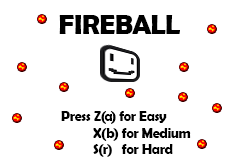

# 🔥 Fireball Dodge - GBA Game

A challenging dodge game built for the Game Boy Advance using low-level C programming and direct hardware manipulation.



## 🎮 Game Overview

Fireball Dodge is an arcade-style survival game where players must navigate through an increasingly dangerous field of bouncing fireballs. Built as part of Georgia Tech's CS 2110 course, this project demonstrates proficiency in embedded systems programming, memory management, and real-time game development.

### 🎯 Objective
Survive the fireball onslaught! Control your character (red sprite) to avoid colliding with bouncing fireballs that spawn every 6 seconds. Each fireball moves with random speed and direction, creating an unpredictable and challenging gameplay experience.

 

## 🕹️ Game Features

### 🏆 Three Difficulty Modes
- **Easy (Button A)**: 2 fireballs, 10-second survival goal
- **Medium (Button B)**: 5 fireballs, 25-second survival goal  
- **Hard (Button R)**: 8 fireballs, 40-second survival goal

### 🎨 Visual Elements
- Custom sprite graphics for player character
- Animated fireball enemies with collision detection
- Dynamic start screen, game over, and victory screens
- Real-time timer display

 

## 🎯 Controls
- **Arrow Keys**: Move character (up, down, left, right)
- **A/B/R Buttons**: Select difficulty at start screen
- **Select Button**: Return to main menu (from any screen)

## 🔧 Technical Implementation

- **Language**: C
- **Platform**: Game Boy Advance (GBA) emulator
- **Graphics**: Mode 3 bitmap rendering with DMA
- **Input**: Hardware button polling
- **Memory**: Direct video buffer manipulation
- **Build System**: CMake with cross-compilation support

## 🚀 Quick Start

1. **Prerequisites**: GBA emulator (VisualBoyAdvance, mGBA, etc.)
2. **Build**: Use included CMake configuration
3. **Run**: Load compiled ROM in emulator
4. **Play**: Select difficulty and survive!

## 📊 Project Structure
```
Fireball-GBAGame/
├── main.c              # Core game logic and state machine
├── gba.c/gba.h         # Low-level GBA hardware interface
├── images/             # Game assets (sprites, backgrounds)
└── CMakeLists.txt      # Build configuration
```

---

**Developed by**: Saahil Sanganeriya  
**Course**: CS 2110 - Computer Organization & Programming (Georgia Tech)  
**Technologies**: C, GBA Development, Embedded Systems Programming
